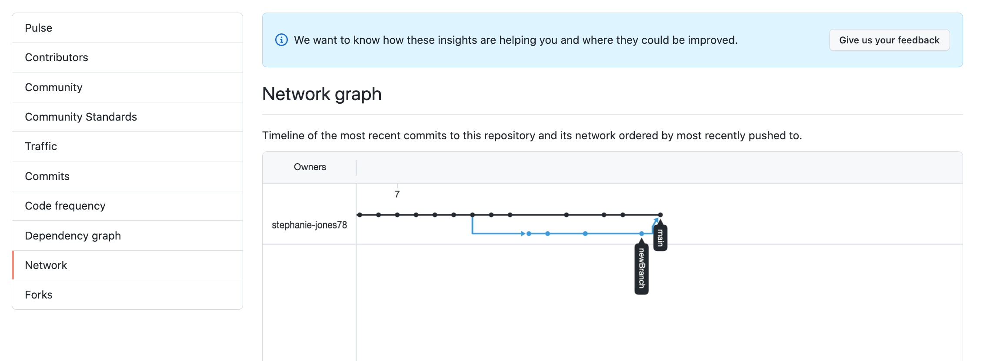
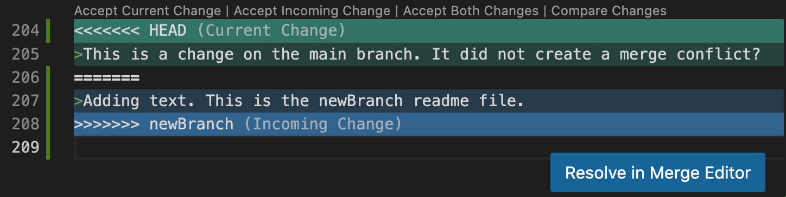

# Learning Git and Github
I listened the Cloud Gurus' [podcast episode](https://podcasts.google.com/u/1/feed/aHR0cHM6Ly9hbmNob3IuZm0vcy81MTA5Mzc2NC9wb2RjYXN0L3Jzcw/episode/OWUwZDhlYmYtMmZkMC00YzcwLWI4NjMtMGI0MWE0ZjY4ZmVj?sa=X&ved=0CAUQkfYCahcKEwjojIW7zK_8AhUAAAAAHQAAAAAQLA) about CI/CD and CI/CT Pipelines and wanted to brush up on some Github concepts and commands. 

<a href="https://podcasts.google.com/u/1/feed/aHR0cHM6Ly9hbmNob3IuZm0vcy81MTA5Mzc2NC9wb2RjYXN0L3Jzcw/episode/OWUwZDhlYmYtMmZkMC00YzcwLWI4NjMtMGI0MWE0ZjY4ZmVj?sa=X&ved=0CAUQkfYCahcKEwjojIW7zK_8AhUAAAAAHQAAAAAQLA">
  
</a>

[This LinkedIn course](https://www.linkedin.com/learning-login/share?forceAccount=false&redirect=https%3A%2F%2Fwww.linkedin.com%2Flearning%2Flearning-git-and-github-14213624%3Ftrk%3Dshare_ent_url%26shareId%3DdvujaFZBS%252BGLk%252FgY2blIrg%253D%253D) had a good walkthrough of Github commands and best practices when collaborating with a team.

## Git Setup
Version control allows us to document the history of a project over time and creating a "time machine" which gives us the ability to jump back and forth through time. Git and GitHub are tools that programmers can use to keep a historical record of those changes to source code files. 

- Git is a software that tracks the changes *and*
- Github is a website that can host files and information about their change history.

>Source: ChatGPT3
```
# configure user name and email
git config --global user.name #your github “Your Name”
git config --global user.email #github email “Your Email”

# initialize local git repository
	# Creates an empty .git folder in local repository
	# This is where git stores all the project information
git init

# connecting to remote git repository
```

## Git Environments
###	Staging
###	Committing
###	Tracking
		Git Log
		Git Status
###	Ignoring
###	Restoring Files to a Previous State

## Changing History
###	Amend
###	Reset
		Soft Reset
		Hard Reset

## Deleting, Renaming, and Moving Files

## Git Branches
###	Developer Collaboration Flow
###	Creating a Branch
###	Branch Rebasing
###	Deleting Branch

## Git Differences
###	Showing the Diff
###	Merge Conflicts

<hr>

## Version Control
Version control allows us to document the history of a project over time and creating a "time machine" which gives us the ability to jump back and forth through time.

## Git Setup
Configuring GIT
```
# git config commands
git config --global user.name #your github “Your Name”
git config --global user.email #github email “Your Email”
```

Initializing Project Folder
```
# initialize local git repository
	# Creates an empty .git folder in local repository
	# This is where git stores all the project information
git init
```

Each Git branch is like an alternate reality that allows you to create alternate *versions* of a project. Essentially, it is a copy of a project that you can work on without changing the original. You can then syncronize branches or go back and forth between them.
- Head is the actual reality
- Main (Master)

## Git Environments
- Working (*last commit status*)
- Staging (*add command - changes queued prior to commit*)
- Commit (*new log entry with hash*)

Staging Files
```# temporarily store files for later commit
git add filename
git add --all
git add -A
git add .
```

Committing Files to History
```# creates a version checkpoint 
git commit -m ‘Your comment’
```
*A Git hash is unique identifier for a commit.*

Reviewing Commit History
```
git log

# viewing condensed version (without scroll)
git log --online
```

Getting File State
```
git status 
```

Restoring File to a Previous State
```git restore filename
git restore --state (staged) filename
git restore . # restores current directory
git checkout . # older version of restore command
```

## Ignoring Files
Files that are not tracked by git or uploaded to GitHub. Create a `.gitignore` file at the root level of project folder with files or file patterns you want to ignore.
```
.DS_Store
.vscode/authentication.js
node_modules
notes/ 
**/*-todo.md
```
*Git doesn't track empty folders*

Creating global ignore file with a `config` variable that captures ignore settings for any new project
```
git config --global core.excludesfile [file]
```

## Deleting, Renaming, and Moving Files
```
# deleting files managed by git
    # also moves deletion event into staging
    # take care of git add 
git rm filename

# renaming files
git mv oldfilename newfilename

# moving files 
git mv oldpath/filename newpath/filename
```

## Differences
Showing the difference between files
```
git diff

# look at a specific hash's diff
git diff hash

# escape diff scroll
q
```
It is difficult to view when there are a lot of changes. In that case better to use VS Code's ***Source Control*** feature.

## Changing History
Going back in time to change history. helps with avoiding messy commit histories.
>This line of code avoids the diverging branch error when changing commit history by force pushing to GitHub
```
# force pushing to github
git push -f origin main
```
### Amend
Amending allows you to add things to last commit
```
# will open text editor for you to add commit message
git commit --amend

# allows you to add commit msg in command
git commit -am 'New commit msg'

# keeps same commit msg
git commit amend --no-edit
```
### Reset
Resetting allows you to go back to a previous commit. Think of this like a ***rewind*** feature that undoes changesm sending them back to an unstaged environment from commited.
```
git reset logHash
```
### Hard Reset
This resets commit history and also modifies files to the state of the commit being reset.
```
git reset --hard logHash
```
### Rebasing
Rebasing takes commit from one branch and applies them to another.
```
git rebase <branch>|<commit>

# let's you use text editor to make changes
git rebase --interactive <branch>|<commit>

# useful for long commit histories when you only want to go back a few steps
git rebase -i HEAD~#

# lets you see all commits, better when you don't have too many commits
git rebase -i --root
```
## Git Branches
Branches let you create different versions of your file(s) so you can play around with different versions of your code.
```
# look at all of the branches in your repository
git branch

# copying a branch (will have same history as current branch)
git switch -c branchName
git checkout -b branchName # older version of switch command

# switching back and forth between branches
git checkout branchName
```
### New Branch, Remote Push
```
# pushing to new branch
git push origin branchName
```

### Deleting Branch
```
# local delete
git branch --delete branchName
git branch -d branchName # branches must be free of conflicts
git branch -D branchName # forces git to ignore conflicts and deletes branch

# remote delete
git push origin --delete branchName
```
### Git Dev Collab Flow
1. Create feature/fix branch
2. Make changes on that branch
3. Merge branch to master
4. Delete branch

In team collaboration, no one messes with the main branch and each teammate has their own working branch. 

### View Graph Commit History

You can visualize your branches and respective commit histories by going to the repo home page on Github > Clicking the top ***Insights*** tab > and then selecting the ***Network*** option on the left nav menu.
### GitHub Protected Branches
You can protect important branches by setting branch protection rules, which define whether collaborators can delete or force push to the branch and set requirements for any pushes to the branch, such as passing status checks or a linear commit history.
>Read about branch protection rules [here](https://docs.github.com/en/repositories/configuring-branches-and-merges-in-your-repository/defining-the-mergeability-of-pull-requests/about-protected-branches).
## Merge Conflicts
Merge conflicts happen when you are merging branches but you or somebody else has made changes to the same items in a file on the same branch. 
```
# while on main branch
git merge newBranch
```
If there have been changes to main branch since last pull while you were working in the new branch, you will get a conflict error message when you try to merge the new branch with main.

In VS Code there is a helper prompt that gives you different options for resolving the error, within the editor window.



## Stashing Code
Stashing is a way of putting away code temporarily so that you can work on something else. Used when you want to restore file to a previous state to work on something else, but not lose the current modifications you have made.
```
# puts changes in temporary "storage facility"
git stash

# see what has been stored
  # any new stashes go to the top of the list
git stash list

# retrieving the stash, applying stash changes
git stash apply

# retrieving the stash, removing stash from the list
git stash pop
```

Let's practice stashing . . .